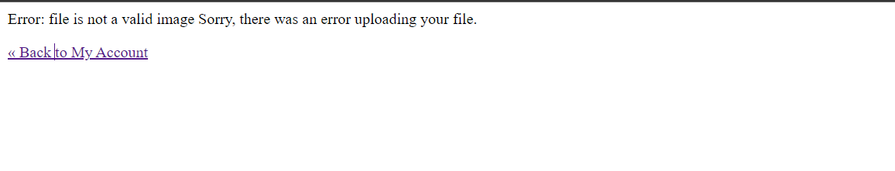
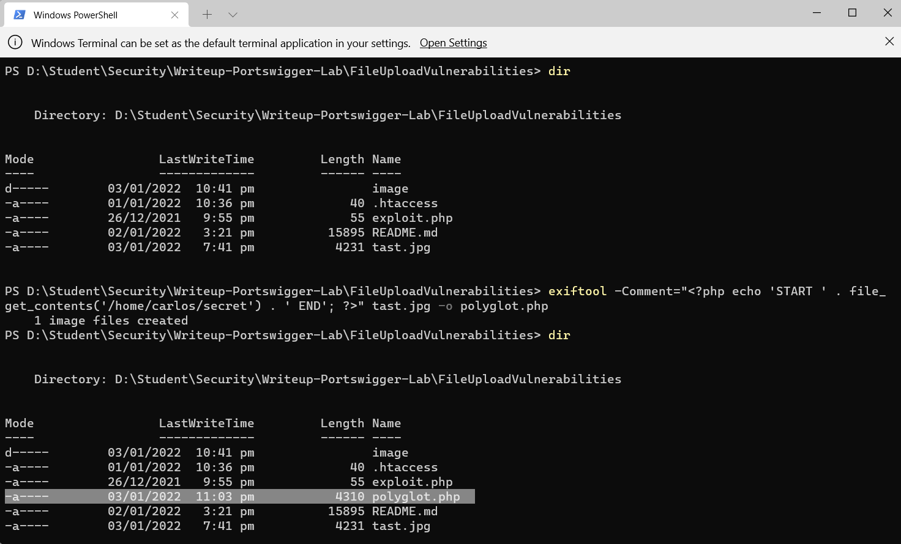
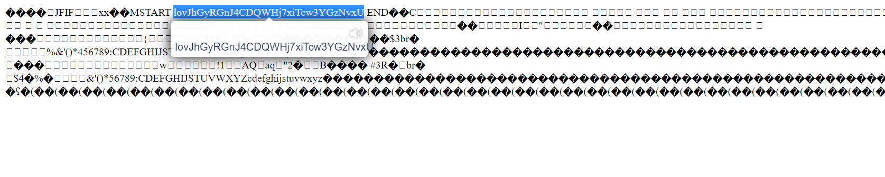
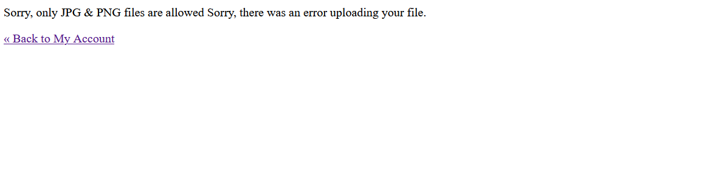
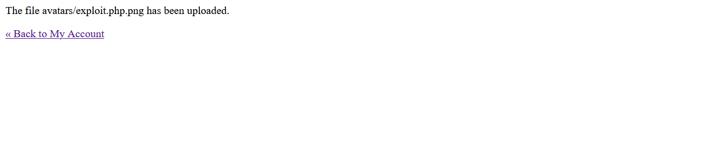
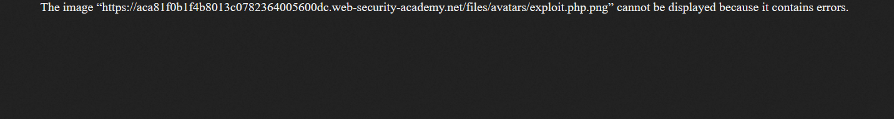
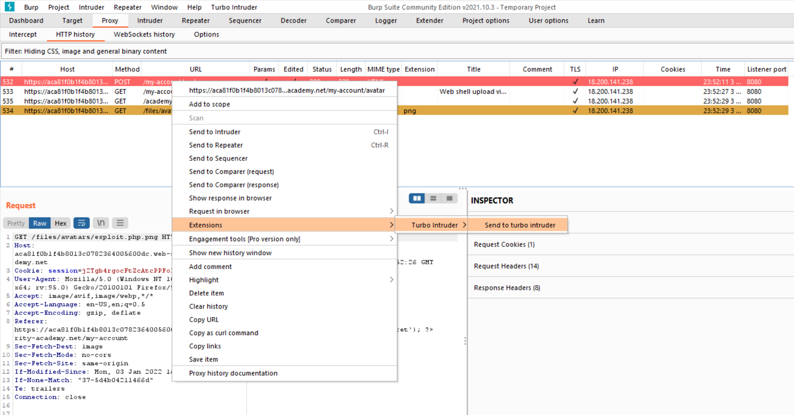
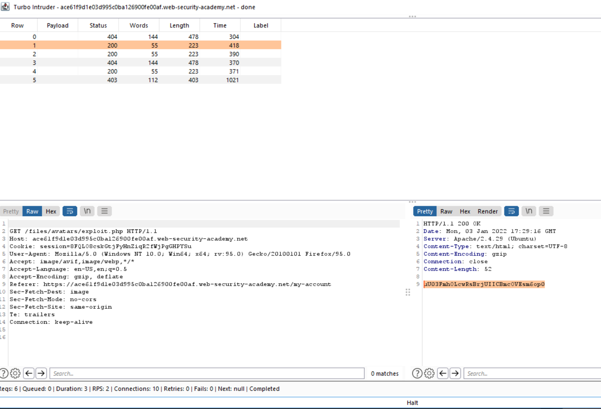

# 🔒 File Upload Vulnerabilities

😘Hey! mình là Hoàng, người đang tìm kiếm đam mê đây là blog đầu tay của mình public mong mọi thứ sẽ ổn.

## Giới thiệu:

Mình được anh mình chỉ [portswigger](https://portswigger.net) để luyện tập và đây cũng là bài đầu tiên của mình ở đó. Ở đây khá hay với bài tập đầu mục đích là làm nổi bật công cụ **burp** làm được gì.
Khá trùng hợp là lỗi **log4j** cũng lổi thời gian gần đây, khi mình mới bắt đầu tìm hiểu phần `Upload File` này. Theo mình tìm hiểu thì **log4j** là một phần trong phần `Upload File`. Ta thấy được `Upload File` không có trong _OWASP2020_ nhưng nó cũng rất nguy hiểm, Nó giúp hacker điều khiển được chương trình hay đọc được các thông tin bảo mật của trang web.

```sh
❓Vậy Upload File Vulnerabilities là gì?
Upload File Vulnerabilities là khi máy chủ web cho phép người dùng tải tệp lên hệ thống tệp nhưng không thể xác định được tệp hay quyền hạn của các tệp.Điều này dẫn đến một chức năng cơ bản cũng có thể tải được các tệp tùy ý có khả năng nguy hiểm.
Điều này có thể tạo ra cơ hội cho những kẻ tấn công tiêm các tập tin độc hại vào máy của bạn. Nếu tin tặc có thể tìm ra cách thực thi các tập tệp đó, chúng làm tổn hại đến hệ thống của bạn.

```

## Yêu cầu:

Tải Burp và cài đặt trên trình duyệt web
Bạn có thể xem ở đây [Burp Suite Installation and Configuration for Windows 10](https://www.youtube.com/watch?v=fDPOMHaeICQ)

## Lab

### Lab1: Remote code execution via web shell upload

Ở bài lab này rất dễ bị tấn công nó không có thực hiện bất kỳ xác thực nào đối với các tệp người dùng tải lên trước khi lưu trữ chúng trên hệ thống tệp của máy chủ.
Yêu cầu của bài là ta cần tải 1 tệp php cơ bản và sử dụng nó để lọc nội dung của tệp _home/carlos/secret_.

Đầu tiên ta cần chuẩn bị một file exploit.php
Bên trong file chúng ta sẽ code:

<?php echo file_get_contents('/home/carlos/secret'); ?>


Sau khi đăng nhập xong ta sẽ vào giao diện upload ảnh.

_Đây là giao diện upload ảnh_

Tiếp theo ta sẽ chọn vào `Brose...` sẽ vào được thư mục tải tệp.


Nhấn chọn file `exploit.php` và Open là xong.

Tiếp theo:
Chúng ta chuyển tiếp sang ứng dụng `Burp`:

- Trong Burp, đi tới Proxy> Lịch sử HTTP
- Ở đây ta có thể xem các requestđi qua `Burp Proxy`
- Chúng ta sẽ chú ý đến GET /files/avatar/exploit.php

  

- Tiếp theo ta sẽ nhấp chuột phải chọn `send to repeate` ở mục Repeater ta sẽ chọn `Send` Và xem kết quả ở phần bên phải

  

- Có kết quả rồi bây giờ ta chỉ việc submit thôi.

##### Tổng kết bài lab1:

- Do đây là bài cơ bản giúp chúng ta làm quen với `Burp` nên thực hiện khá nhanh chóng và dễ dàng.
- Lỗi tải tệp lên ở đây là lỗi sơ khai nhất không hề có bảo mật gì khi tải tệp. Giúp cho hacker dễ dàng lấy đi thông tin bảo mật của chủ trang web.

### Lab2: Web shell upload via Content-Type restriction bypass

Ở bài lab này người ta sử dụng phương pháp xác thực loại tệp. Nói một cách dễ hiểu hơn ở mục tải ảnh như bài lab bên trên ta không thể tải trực tiếp file php nữa, bởi vì file tải nên phải thộc kiểu img/png.

```sh
Trước khi vào bài ta cần làm quen với content-type(kiểu dứ liệu). Khi gửi biểu mẫu HTML, trình duyệt của bạn thường gửi dữ liệu được cung cấp trong một POST yêu cầu với loại nội dung `application/x-www-form-url-encoded`. Cái này chỉ phù hợp khi nó là nhập tên, địa chỉ... Nó không phù hợp với tài liệu hay chuỗi nhị phân. Trong trường hợp này `multipart/form-data` là cách tiếp cận ưu tiên.
```


- Ở ảnh này ta thấy nội dung được chia thành 2 phần riêng biệt. `Content-Disposition` là tiêu đề cho mỗi phần còn `content-type` xác định kiểu dữ liệu cho mỗi phần. Tiêu đề này cho biết kiểu MIME của dữ liệu đã được gửi bằng cách sử dụng đầu vào này.

```sh
💡MIME là gì?
Theo wiki: Giao thức mở rộng thư điện tử Internet đa mục đích hay MIME (Multipurpose Internet Mail Extensions) là một tiêu chuẩn Internet về định dạng cho thư điện tử.
```

- Một cách mà web có thể xác thực kiểm tra tệp tải lên là xem Content-type tiêu đề có khớp với MIME dự kiến không. VD: chỉ cho phép các loại tệp image/jpeg và image/png. Biện pháp bảo vệ này có thể dễ dàng bị bỏ qua bởi các công cụ `Burp` .

Tương tự như các phần trên khi tải file `exploit.php` lên thì sẽ không được.


Đầu tiên bạn chọn `Back to My Account` để trở về
Bây giờ bạn hãy chọn `Proxy` > `Intercept` > `Intercept is off` để bật nó lên.


Rồi bạn thử tải lại file `exploit.php`.
Bạn giờ hãy vào lại `Burp`.


Bạn sẽ vào chỉnh sửa phần contnt type mà mình đã gạch chân thành `image/jpeg'`và chọn Forward ở bên góc trái.


Vậy là ta đã thành công tải tệp lên. Các bước còn lại sẽ giống với bài lab1 he.

##### Tổng kết bài lab2

- Cá nhân mình thấy bài này tuy thêm được phần xác định loại file nhưng vẫn rất dễ dàng bị dánh lừa.

## Lab3: Web shell upload via path traversal

Ở bài lab này sẽ ở lever cao hơn bài trước, ta sẽ thấy được file php của ta vẫn được tải lên nhưng lại không thực thi được code. Lúc này máy chủ chỉ thực hiện các fille có kiểu MIME mà đã được định cấu hình để thực thi. Nếu không phải kiểu MIME chỉ định nó sẽ thông báo lỗi hoặc trong một số trường hợp chúng phân phát nội dung của tệp dưới một dạng văn bản thuần túy thay thế.

Để làm được bài này ta cần hiểu thêm về `Directory traversal`
Sau khi đã hiểu khái quát được giờ ta sẽ bắt tay vào làm bài lab này.

Như các bài lab trên bây giờ ta thử tải 1 file `exploit.php`lúc này ta sẽ nhận được thông báo tải file thành công.


Nhưng ở trong `Repeater` ta thấy được file `exploit.php` truyền lên ở dạng text không được thực thi.


Như đã nói ở trên.

```sh
 Nếu không phải kiểu MIME chỉ định nó sẽ thông báo lỗi hoặc trong một số trường hợp chúng serve nội dung của tệp dưới một dạng văn bản thuần túy thay thế.
```

Để giải quyết vấn đề này ta thử tải file `exploit.php` lên thư mục cha của nó. Muốn làm được cách này mình nghĩ bạn phải hiểu [Directory traversal](https://portswigger.net/web-security/file-path-traversal).

Bây giờ ta thử tải file `exploit.php` lên thư mục cha của nó bằng cách gửi file vào `..\exploit.php`
Ta sẽ vào `purb` và làm điều đó.


Nhưng điều này có vẻ vẫn chưa được ở mục history của Proxy


Ở dạng bài này máy chủ web đã loại bỏ bất cứ trình tự nào trước khi chuyển đầu vào của ứng dụng.
Bây giờ ta có thể thử bằng cách [URL endcoding](https://www.urlencoder.org/). Ta sẽ `endcode` ký tự ..\ thay bằng ..%2f


Sau khi sử xong ta forward và về history chọn GET /files/avatar/..%2fexploit.php click chuột phải chọn [Directory traversal](https://portswigger.net/web-security/file-path-traversal).


Ở kết quả `Repeater` ta sen và được kết quả.


##### Tổng kết bài lab3

Ta thấy được ở bài này có hai vấn đề cần giải quyết:

- Làm sao để tải file `exploit.php` lên thư mục cha để tránh bị báo lỗi hoặc serve dưới dạng văn bản thuần túy.
- làm sao để `endcode` tránh cho máy chủ web đã loại bỏ bất cứ trình tự nào trước khi chuyển đầu vào của ứng dụng

### Lab4 Web shell upload via extension blacklist bypass

Ở bài này vấn đề ở các web chặn các web shell vd đơn giản hơn có thể hiểu là các nhà mạng cấm việc người dùng vào các trang web phim người lớn bằng cách họ cho các miền trang web đó vào danh sách đen. Khi truy cập vào trang web này sẽ thông bóa lỗi. Tương tự ở trong bài file php của chúng ta đã bị cho vào blacklist.


Ta có thể thử cách thay đổi thử đuôi file như bên dưới.
**
Hacker có thể có thể đổi đuôi extension thành shell.php1 ,shell.php2 ,shell.php3 ,… Và thậm chí shell vẫn có thể chạy với các đuôi như .pl hoặc .cgi
Nếu tất cả các đuôi bạn thử đều đã nằm trong danh sách đen, chúng ta có thể check xem bộ lọc có phân biệt chữ hoa chữ thường không : shell.Php1, shell.PHP2 ,….
Đôi khi ,nhà phát triển có thể tạo 1 regex kiểm thử .jpg ,vì vậy chúng ta có thể thử cách chồng extension như là shell.jpg.php
**

_Mình cũng đã làm được bằng cách đổi đuôi file._

Đầu tiên mình tải file `exploit.php` lên rồi mình sang burp sửa đuôi file như trong hình.


Và mình đã thành công lấy đc mật mã.

_Ngoài ra mình cũng thử cách sử dụng .htaccess file._

```sh
Tập tin .htaccess (hypertext access) là một file có ở thư mục gốc của các hostting và do apache quản lý, cấp quyền. File .htaccess có thể điều khiển, cấu hình được nhiều thứ với đa dạng các thông số, nó có thể thay đổi được các giá trị được set mặc định của apache.
```

Ta cần chuẩn bị một file có đuôi .htaccess. Trong file ta code `AddType application/x-httpd-php .yeah ( tuỳ thuộc extension bạn chọn)`


Tiếp theo ta up file `exploit.php` và thay đổi đuôi `exploit.php` thành file `exploit.yeah`.


##### Tổng kết bài lab4.

- Do là `blacklist` nên chương trình chỉ chạy các file không có trong `blacklist`. Nên ngay cả khi `blacklist` đầy đủ nhất cũng có thể bị bỏ qua bằng cách sử dụng các kỹ thuật obfuscation.

### Lab5: Web shell upload via obfuscated file extension

Ta cũng thể có thể đạt được kết quả tương tự bằng cách sử dụng các kỹ thuật sau:

- Tùy thuộc vào thuật toán được sử dụng để phân tích cú pháp tên tệp, tệp sau có thể được hiểu là tệp PHP hoặc hình ảnh JPG: _exploit.php.jpg_

- Thêm ký tự ở cuối. Một số thành phần sẽ loại bỏ hoặc bỏ qua các khoảng trắng theo sau, dấu chấm, và những thứ tương tự như: _exploit.php._

- Hãy thử sử dụng mã hóa URL (hoặc mã hóa URL kép) cho các dấu chấm, dấu gạch chéo về phía trước và dấu gạch chéo ngược. Nếu giá trị không được giải mã khi xác thực phần mở rộng tệp, nhưng sau đó được giải mã phía máy chủ, điều này cũng có thể cho phép bạn tải lên các tệp độc hại mà nếu không sẽ bị chặn: _exploit%2Ephp_

- Thêm dấu chấm phẩy hoặc ký tự byte rỗng được mã hóa URL trước phần mở rộng tệp. Ví dụ: nếu xác thực được viết bằng ngôn ngữ cấp cao như PHP hoặc Java, nhưng máy chủ xử lý tệp bằng cách sử dụng các hàm cấp thấp hơn trong C/C++, điều này có thể gây ra sự khác biệt trong những gì được coi là phần cuối của tên tệp: _exploit.asp;.jpg or exploit.asp%00.jpg_

- Hãy thử sử dụng các ký tự unicode nhiều byte, có thể được chuyển đổi thành byte và dấu chấm rỗng sau khi chuyển đổi hoặc chuẩn hóa unicode. Các chuỗi như xC0 x2E, xC4 xAE hoặc xC0 xAE có thể được dịch thành x2E nếu tên tệp được phân tích cú pháp thành chuỗi UTF-8, nhưng sau đó được chuyển đổi thành ký tự ASCII trước khi được sử dụng trong một đường dẫn.

Trong bài lab mình có làm vd bằng cách sử dụng byte rỗng mình đã thêm `%00.jpg` vào đuôi file. Việc thêm `%00.jpg` sẽ loại bỏ được file `jpg` bởi `%00` đại diện cho dấu cách. giúp ta thực thi file `php`.


Mình cũng đã up file thành công lên.


Sau khi mình đổi đuôi file và chạy mình cũng khá ngạc nhiên khi vào `Burp` phần kết quả ở `Proxy` > `history` > `Get /files/avatars/exploit.php%00.jpg` kết quả lại không ra.


```sh
Vậy vấn đề ở đâu?
Nhưng rồi mình mới hiểu ra ở phần history mình đang truy cập và file `exploit.php%00.jpg` chứ không phải `exploit.php`.
```

Tiếp theo mình đã vào mục repeate của file `exploit.php%00.jpg` rồi mình thay đổi thành `Get /files/avatars/exploit.php`. Bây giờ ta thử `send` và xem kết quả nào.


##### Tổng kết bài lab5.

- Qua bài ta thấy rõ hơn việc không có gì gợi là chặt chẽ tuyệt đối cả. Tuy phần lỗ hổng file này rất hiếm gặp ở thời điểm hiện tại. Bởi các website không còn cơ bản như trước nhưng trang bị kiến thức này là phần tất yếu để tránh những rủi ro xảy ra.

### Lab6: Web shell upload via obfuscated file extension

- Trong bài lab này thay vì hoàn toàn tin tưởng vào `Conten-Type`, các máy chủ cố gắng xác minh rằng nội dung của tệp có thực sự là file đúng nội dung hay không.
- Trong trường hợp có chức năng tải lên hình ảnh, máy chủ cố gắng xác minh các thuộc tính nhất định của hình ảnh, chẳng hạn như kích thước hình ảnh. VD: Nếu bạn thử tải lên một tệp php, thì nó sẽ không bất kỳ kích thước nào cả. Do đó máy chủ suy luận rằng nó không phải là một hình ảnh từ chối tải lên tương ứng.
- Tương tự, một số loại tệp nhất định có thể luôn chứa một byte cụ thể trong đầu trang hoặc chân trang của chúng. Chúng có thể được sử dụng như dấu vân tay hoặc chữ ký để xác định xem nội dung có khớp với loại mong đợi hay không. Ví dụ, các tệp `JPEG` luôn bắt đầu bằng các byte `FF D8 FF`.
- Đây là một cách xác thực loại tệp mạnh mẽ hơn nhiều, nhưng ngay cả điều này cũng không dễ dàng. Bằng cách sử dụng các công cụ đặc biệt, chẳng hạn như `ExifTool`, việc tạo một tệp `polyglot JPEG` có chứa mã độc hại trong siêu dữ liệu của nó có thể trở nên khó khăn.

Bắt đàu với bài lab mình có tải 1 file `exploit.php` nhưng máy chủ thông báo không tải được. Tiếp theo mình có mở rộng thêm file `exploit.php%00.jpg` nhưng vẫn báo lỗi.



Đó là do máy chủ kiểm tra file và do không phải là kiểu `image/jpeg` như mình đã nói ở trên nên không được duyệt.
Bây giờ ta thử dùng exiftool để chèn mã độc vào ảnh. Ta gõ lệnh trong cmd `exiftool -Comment="<?php echo 'START ' . file_get_contents('/home/carlos/secret') . ' END'; ?>" <YOUR-INPUT-IMAGE>.jpg -o polyglot.php`

💡 Các bạn cần tải [Exiftool](https://exiftool.org/) mới dùng được nha.



Lúc này mình chỉ cần up file `polyglot.php` là xong.

Ta sẽ thu được kết quả của bài.



### lab7: Web shell upload via race condition

- Các modern framework ngày càng bảo mật hơn trước các cuộc tấn công như vầy.Chúng thường không tải tệp trực tiếp lên đích dự kiến của chúng trên hệ thống tệp. Thay vào đó, họ thực hiện các biện pháp phòng ngừa như tải lên `temporary file`, `sandboxed directory` trước tiên và đặt tên ngẫu nhiên để tránh ghi đè các tệp hiện có. Sau đó, họ thực hiện xác thực trên `temporary file` này và chỉ chuyển nó dến đích khi nó được coi là an toàn để làm như vậy.
- VD: Một trang web tải tệp lên hệ thống chính và sau đó xóa nếu tệp không vượt qua xác thực. Loại hành vi này là điển hình trong các trang web dựa vào đó phần mềm chống virus và những thứ tương tự để kiểm tra phần mềm đọc hại. Quá trình này có thể chỉ mất vài mini giây, nhưng trong thời gian ngắn mà tệp tồn tại trên máy chủ, kẻ tấn công vẫn có thể thực thi nó.
- Những lỗ hổng này thường cực kỳ tinh vi, khiến chúng khó bị phát hiện trong quá trình hộp đen trừ khi bạn có thể tìm ra cách rò rỉ mã nguồn liên quan.

Vào trong bài lab ta up thử file `exploit.php` nhưng báo lỗi vì đây không phải file ảnh.



Bây giờ ta thử mở rộng file thành `exploit.php.png` ta đã up được file thành công.



Nhưng có vẻ không thực thi được tệp `php`.



Bây giờ ta có thể sử dụng `Turbo Intruder`. Ta vào `HTTP story` > `POST /my-acount/avatar` > ` Chuột phải` > `Extentions` > `Send to turbo intruder`



```sh
def queueRequests(target, wordlists):
    engine = RequestEngine(endpoint=target.endpoint, concurrentConnections=10,)

    request1 = '''<Request POST /my-acount/avatar>'''

    request2 = '''<Request GET /files/avatars/exploit.php.png>'''

    # the 'gate' argument blocks the final byte of each request until openGate is invoked
    engine.queue(request1, gate='race1')
    for x in range(5):
        engine.queue(request2, gate='race1')

    # wait until every 'race1' tagged request is ready
    # then send the final byte of each request
    # (this method is non-blocking, just like queue)
    engine.openGate('race1')

    engine.complete(timeout=60)


def handleResponse(req, interesting):
    table.add(req)
```

Bây giờ `Attack`. Nhận được kết quả ở `Status 200`.



### Tổng kết

##### Cách ngăn chặn lỗ hổng tải lên tệp

- Việc cho phép người dùng tải tệp lên là điều phổ biến và không nguy hiểm miễn là bạn thực hiện đúng các biện pháp phòng ngừa. Nói chung, cách hiệu quả nhất để bảo vệ các trang web của riêng bạn khỏi những lỗ hổng này là thực hiện tất cả các phương pháp sau:

- Kiểm tra phần mở rộng tệp với whitelist gồm các phần mở rộng được phép thay vì blacklist gồm các phần mở rộng bị cấm. Việc đoán những tiện ích mở rộng bạn có thể muốn cho phép dễ dàng hơn nhiều so với việc đoán những tiện ích mở rộng mà kẻ tấn công có thể cố gắng tải lên.

- Đảm bảo rằng tên tệp không chứa bất kỳ chuỗi con nào có thể được hiểu là thư mục hoặc chuỗi truyền tải (../).

- Đổi tên tệp đã tải lên để tránh va chạm có thể khiến tệp hiện có bị ghi đè.

- Không tải tệp lên hệ thống tệp vĩnh viễn của máy chủ cho đến khi chúng đã được xác thực hoàn toàn.

- Càng nhiều càng tốt, hãy sử dụng một established framework để preprocessing trước quá trình tải lên tệp thay vì cố gắng viết các cơ chế xác thực của riêng bạn.
